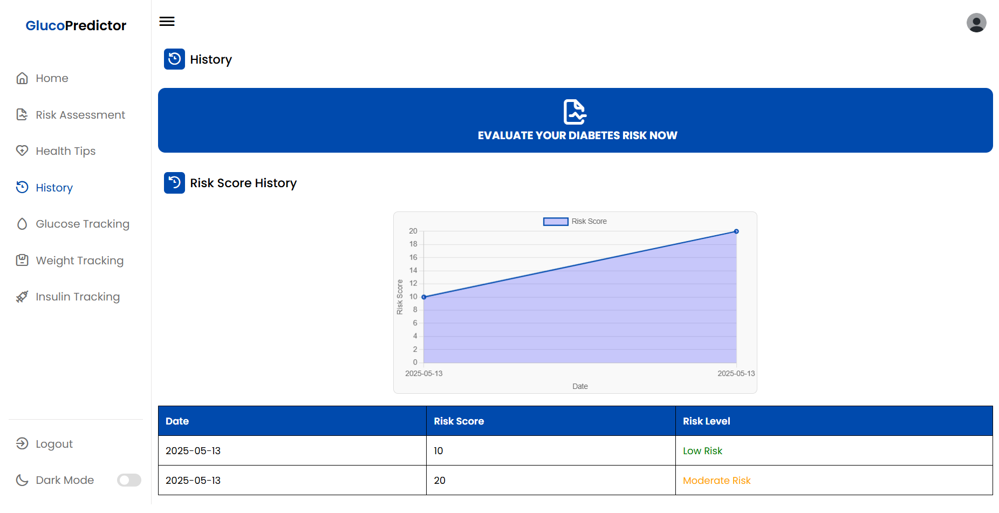

# GlucoPredictor 🩺📊

**GlucoPredictor** is a web-based diabetes risk assessment and data entry system designed to help users evaluate and monitor their potential risk for diabetes. The system allows users to perform diabetes risk assessments, obtain risk assessments results, and track their glucose levels, insulin usage, and weight, while providing personalized rule and AI-based health tips using a trained XGBoost model and educational insights about diabetes.

**Note:** Some portions of this code were developed with assistance from AI tools (e.g., ChatGPT). All AI-generated content has been reviewed and adapted by the developer to ensure accuracy and suitability for the project.

## 📷 Screenshots





## ⚠ Disclaimer
**GlucoPredictor** is intended for educational and non-commercial use only.
This project is not a certified medical device or diagnostic tool. The results and health tips provided are based on general rules and AI predictions, and should not be considered as medical advice or diagnosis.

**Always consult with a qualified healthcare professional for medical concerns or before making decisions about your health.**


## 🌟 Features

1. **User Authentication**:
    - Registration, login, and email verification using PHPMailer.
    - Admin panel to manage users and system access.

2. **Risk Assessment**:
    - Calculates diabetes risk using both rule-based logic and AI-based predictions (XGBoost).
    - Past risk assessment results can be tracked on the history page.

3. **Health Tracking**:
    - Track glucose levels, insulin usage, and weight by inputting the required data visualized by chart and tables. 

4. **Personalized Health Tips**:
    - Receive health tips based on risk levels and other factors.
    - AI-generated bonus tips fostering and motivating healthier living.

5. **Bilingual Support**:
    - Supports English and Malay languages.

6. **Responsive Design**:
    - Mobile-friendly with a dark mode toggle.
  
7. **Reset Password**:
     - Users and can reset thier passwords if forgotten.
  
8. **Edit Profile**:
      - Users can edit their username and passwords whenever desired.
  
9. **Account Deletion**:
      - Users can delete their accounts along with thier risk assessment details.
  
10. **Admin Dashboard**:
      - Admins with the role of Admin granted on phpMyAdmin can manage and remove users, view amount of users, and allowed to edit their own admin profile's username and passwords.


## ⚙️ Technologies Used

  - **Frontend**: HTML, CSS, Bootstrap & JavaScript
  - **Backend**: PHP
  - **Machine Learning**: XGBoost (Python)
  - **Database**: MySQL (phpMyAdmin)
  - **Server**: Apache (XAMPP for local hosting)


## 🧪 How It Works

1. **User Registration & Login**:
     - Users can sign up, activate their accounts via email and log in to access the system.
     - Admin users can manage other users.
   
2. **Data Input**:
     - Users input information such as age, gender, number of pregnancies, weight, height, family history, high blood pressure diagnosis, activity level, sugar consumption & symptoms on the `form.php` page.
     - Users can input information glucose levels, insulin intake & weight on the `glucose.php`, `weight.php` & `insulin.php` tracking pages to monitor them visually with a chart or table if desired.
   
3. **Risk Calculation**:
     - Risk is calculated using predefined rules via JavaScript and an AI model [`predict.py`] based on the risk assessment form input details and displayed on the `result.php` page.
   
4. **Health Tips**:
     - Based on the obtained risk assessment result, users receive personalized rule & AI-based health tips on the `tips.php` page.
   
5. **Risk Score History Tracking**:
     - Users can view their stored risk score history on the `history.php` page.


## 🛠️ Installation

Follow these steps to set up **GlucoPredictor** on your local machine:


1. **Install Required Software**

    - [**XAMPP**](https://www.apachefriends.org/index.html) – to run Apache & MySQL locally.
  
    - [**Python 3**](https://www.python.org/downloads/) – for running the AI model.
   
    - [**Composer**](https://getcomposer.org/download/) – to install PHP dependencies like PHPMailer for account activation, email verification and reset password.
  
    - [**Git**](https://git-scm.com/downloads) – to clone the repository (optional).


3. **Clone the repository**:
   ```bash
   git clone https://github.com/yourusername/GlucoPredictor.git
    ```
   

4. **Set Up the Database**:
    - Open XAMPP Control Panel and start Apache & MySQL.
  
    - Go to http://localhost/phpmyadmin.
  
    - Create a new database named: glucopredictor
  
    - Import the SQL file (glucopredictor.sql) if available:
  
    - Click on the new database
  
    - Go to the Import tab
  
    - Upload and execute the .sql file


4. **Configure Database Connection**:
    - In any PHP files that connect to the database (e.g., form.php, login.php), ensure your database credentials are correct:
  
      ```bash
      $conn = new mysqli("localhost", "root", "", "glucopredictor");
      ```
  
    - If your MySQL password is not empty, update it accordingly.


5. **Install Composer Dependencies (PHPMailer)**:
    - GlucoPredictor uses PHPMailer for sending email verification and activating accounts.
    
    - Make sure Composer is installed:
       [**Download Composer**](https://getcomposer.org/download/)

    - Open your terminal (CMD or Bash) and navigate to your project directory:

      ```bash
      cd C:\xampp\htdocs\glucopredictor
      ```
    - Run the following command to install PHPMailer:

      ```bash
      composer require phpmailer/phpmailer
      ```
      
    - The PHPMailer files will be downloaded into the vendor/ directory.

    - Make sure to include the Composer autoload in any file that uses PHPMailer:
    
      ```bash
      require 'vendor/autoload.php';
      ```

6. **Set Up the Python Environment (AI Model)**:
    - Open Command Prompt or Terminal.
  
    - Navigate to the ml/ folder:
  
      ```bash
      cd C:\xampp\htdocs\glucopredictor\ml
      ```
  
    - Install the required Python libraries:
  
      ```bash
      pip install xgboost numpy
      ```
  
    - Make sure the following files are present:
  
      - predict.py
    
      - xgboost_diabetes_model.json

    - These are used to run the AI-based prediction.

## 📘 How to Use

- Register an account and activate your account via email.
  
- Login using the registered email address and password.
  
- Evaluate your risk of diabetes by performing a diabetes risk assessment by filling the provided form with the neccesary details.
  
- Get your risk calculated upon valid form submission.
  
- Receive and view your personalized health tips based on your risk assessment form inputs and results.
  
- Check your risk assessment history for past risk scores and levels.

- Monitor you glucose, weight, and insulin intakes by filling the add entry forms with the required details as well as clear each entry if desired.

## 🧑‍💻 Author
  ©️ Jegathiswaran Thiaghu
  
  GitHub: https://github.com/jega1312


