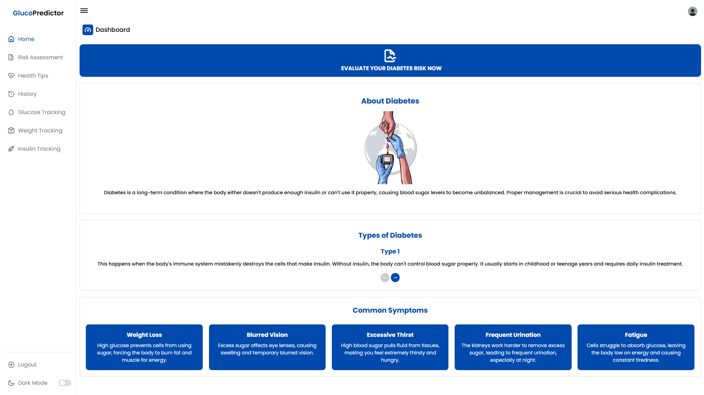

# GlucoPredictor 🩺📊

**GlucoPredictor** is a web-based diabetes risk assessment and data entry system designed to help users evaluate and monitor their potential risk for diabetes. The system allows users to perform diabetes risk assessments, obtain risk assessments results, and track their glucose levels, insulin usage, and weight, while providing personalized rule and AI-based health tips using a trained XGBoost model and educational insights about diabetes.

## 📷 Screenshots





## 🌟 Features

**User Authentication**:
  - Registration, login, and email verification using PHPMailer.
  - Admin panel to manage users and system access.

**Risk Assessment**:
  - Calculates diabetes risk using both rule-based logic and AI-based predictions (XGBoost).

**Health Tracking**:
  - Track glucose levels, insulin usage, and weight.

**Personalized Tips**:
  - Receive health tips based on risk levels and other factors.
  - AI-generated bonus tips for healthier living.

**Multilingual Support**:
  - Supports English and Malay languages.

**Responsive Design**:
  - Mobile-friendly with a dark mode toggle.

## ⚙️ Technologies Used

  - **Frontend**: HTML, CSS, Bootstrap, JavaScript
  - **Backend**: PHP
  - **Machine Learning**: Python (XGBoost)
  - **Database**: MySQL (phpMyAdmin)
  - **Server**: Apache (XAMPP for local hosting)

## 🧪 How It Works

1. **User Registration & Login**:
     - Users can sign up and log in to access the system.
     - Admin users can manage other users.
   
2. **Data Input**:
     - Users input information such as age, weight, glucose levels, insulin usage, and symptoms.
   
3. **Risk Calculation**:
     - Risk is calculated using predefined rules via JavaScript and an AI model (`predict.py`).
   
4. **Health Tips**:
     - Based on the risk level, users receive health tips on the `tips.php` page.
   
5. **History Tracking**:
     - Users can view their risk history through the `history.php` page.

## 🛠️ Installation

1. Clone the repository:
   ```bash
   git clone https://github.com/yourusername/GlucoPredictor.git
